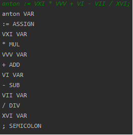
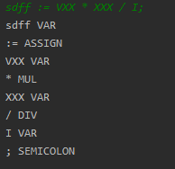

# TAFI_pr3
<b>Цель работы</b>
 
Знакомство с лексическим анализом, построение собственного лексического анализатора.
Выполнения практической работы

<b>Задание:</b>  
Написать программу, которая выполняет лексический анализ входного текста в соответствии с заданием   
и порождает таблицу лексем с указанием их типов. Программа должна выдавать сообщения о наличии во входном  
тексте ошибок, которые могут быть обнаружены на этапе лексического анализа;  
<b>Вариант 7</b>  
Входной язык содержит арифметические выражения, разделённые символом ; (точка с запятой).  
Арифметические выражения состоят из идентификаторов, римских чисел, знака присваивания (:=),  
знаков операций +, –, *, / и круглых скобок. Римскими считать числа, записанные большими буквами X, V и I.  

<b>Результат работы</b>  
 
Рисунок 1 - Пример работы программы 
 
 
Рисунок 2 - Пример работы программы 
 

<b>Выводы по работе:</b> 
Мы познакомились с лексическим анализом, построили собственный
лексический анализатор.
